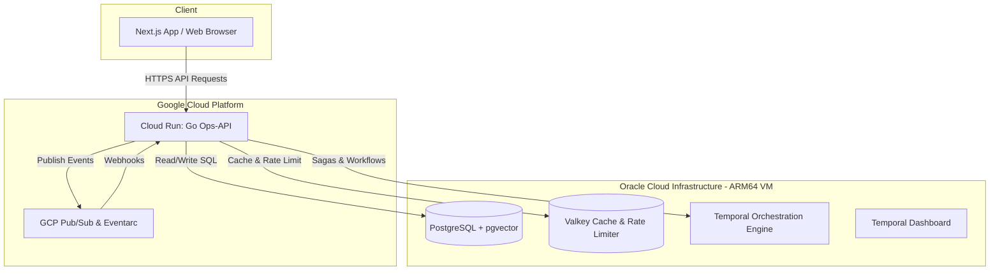

# Architecture & Network Topology

Synq utilizes a hybrid-cloud design, distributing workloads between **Google Cloud Platform (GCP)** and **Oracle Cloud Infrastructure (OCI)**. This split maximizes performance-per-dollar, keeping stateless processing in cost-efficient serverless layers and stateful databases on bare-metal or high-performance VMs.

## Cloud Topology Diagram

## Workload Placement Rationale

### Google Cloud Platform (GCP)
GCP hosts the stateless runtime and event routing components:
* **Cloud Run:** Highly scalable, zero-to-N autoscaling container hosting. By routing DNS directly through Cloud Run's native `domain-mappings` CNAME to `ghs.googlehosted.com`, we completely bypass the expensive GCP Application Load Balancer (ALB) and Network Endpoint Groups (NEG), saving significant monthly budget.
* **Pub/Sub & Eventarc:** Enterprise-grade asynchronous event distribution. Events published by PIM or OMS modules stream through Pub/Sub and route back via Eventarc webhooks to trigger side effects.

### Oracle Cloud Infrastructure (OCI)
OCI hosts the stateful backbone on Ampere A1 ARM64 Compute instances:
* **PostgreSQL + pgvector:** Relational database with vector search capabilities for recommendation and semantic matching.
* **Valkey:** High-throughput cache and rate limiter.
* **Temporal:** The orchestration coordinator. Stateful workflows and activity histories reside here, protected by OCI virtual cloud network (VCN) security policies.
