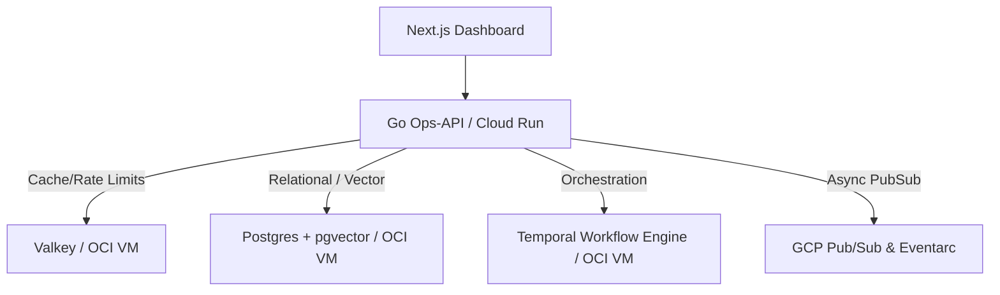

# Introduction to Synq

Welcome to the official documentation for **Synq**, a modern, state-of-the-art enterprise commerce platform. 

Synq is built with an event-first philosophy, designed to run at scale with a hybrid infrastructure footprint that balances performance, cost, and reliability.

## Platform Pillars

### 1. High Performance Caching & Security
We use **Valkey** (a Redis-compatible, high-performance caching layer) for request rate limiting, data caching, and ephemeral session storage. Valkey acts as our first line of defense against DoS attacks and database connection exhaustion.

### 2. Multi-Tenant Isolated Storage
Our relational data engine runs on **PostgreSQL** with the `pgvector` extension. To ensure strict enterprise data privacy, we implement defense-in-depth security using Postgres **Row Level Security (RLS)**. Every tenant and organization has isolated database contexts enforced at the database level.

### 3. Resilient Orchestration
All business-critical pipelines—such as order fulfillment sagas, payment authorizations, and sales channel synchronization—are orchestrated using **Temporal**. Temporal ensures that even if individual microservices crash or network requests fail, workflows resume safely from their last state.

### 4. Hybrid Cloud Topology
To optimize operational costs and cloud spend, Synq leverages a unique hybrid topology:
* **Google Cloud Platform (GCP):** Runs serverless, stateless API endpoints (Cloud Run), and event broker systems (GCP Pub/Sub, Eventarc).
* **Oracle Cloud Infrastructure (OCI):** Runs stateful services (PostgreSQL, Valkey, and Temporal) on high-performance Ampere A1 (ARM64) instances within the free tier.
